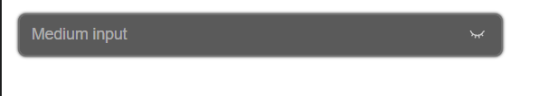
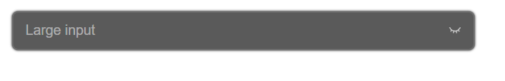
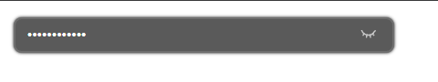
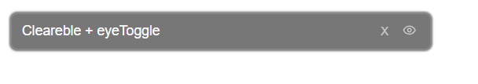
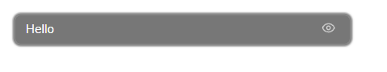
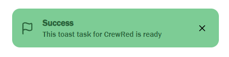
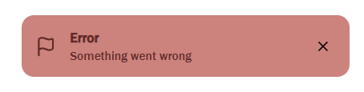
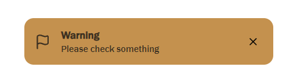
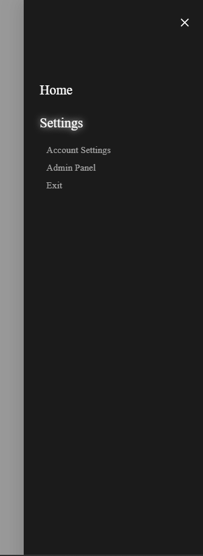

# React UI Library

Front-end js test assessment
Andrew Baganich

---

A small React UI component library built with:

- React
- TypeScript
- CSS Modules
- Storybook

---

## Components

### Input
- Controlled/uncontrolled component
- Disable prop
- Clearable
- Password visibility toggle
- Sizes: sm | md | lg

## Small size

## Medium size

## Large size

## Password

## Clearable password

### Toggle visibility

---

### Toast
- Bottom-right position
- Auto dismiss (3000ms)
- Variants (success / error / warning)
- FadeIn/FadeOut animation 

## Success

## Error

## Warning

---

### Sidebar Menu
- Slides from right
- Nested submenu (accordion behavior)
- Overlay click to close
- Controlled open state

## Menu Button

## Sidebar Opened

Thank you, i learned a lot of things!
---